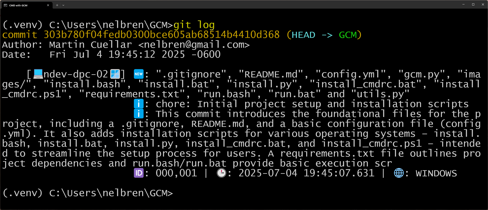
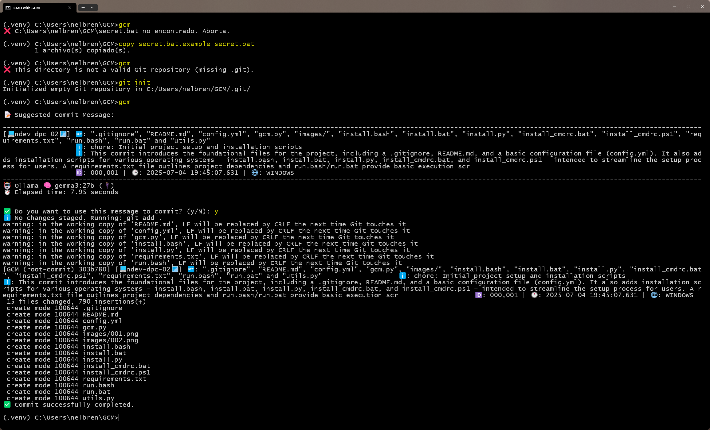
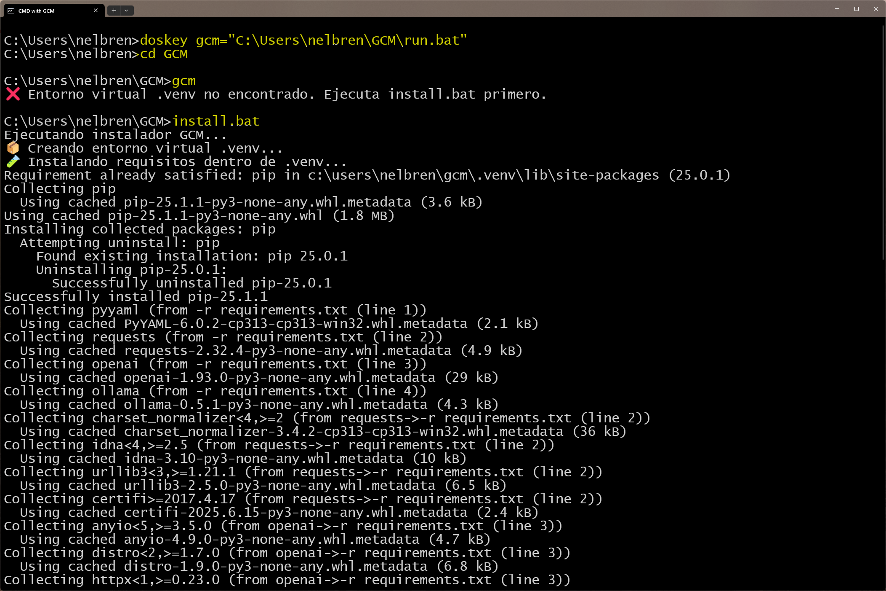
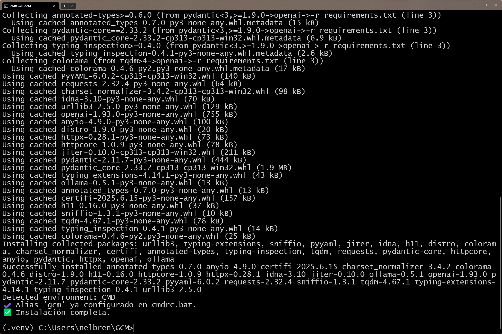
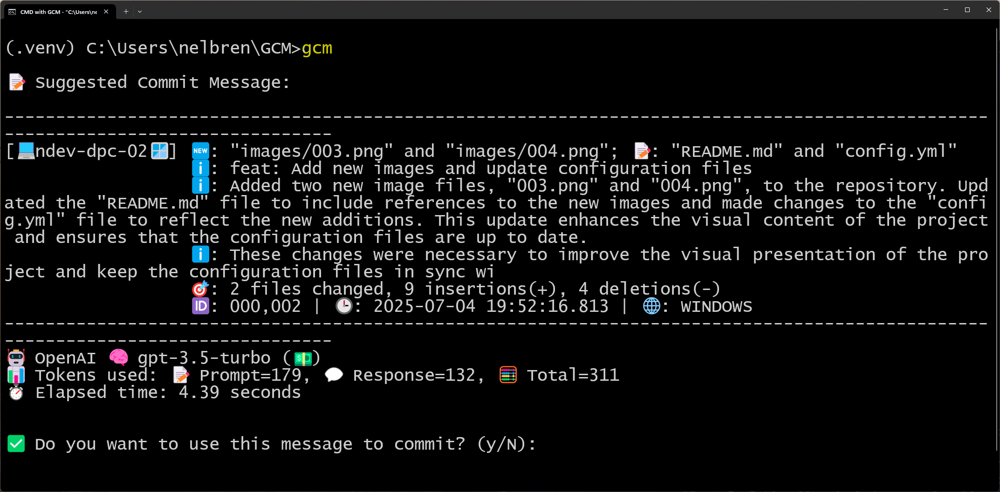
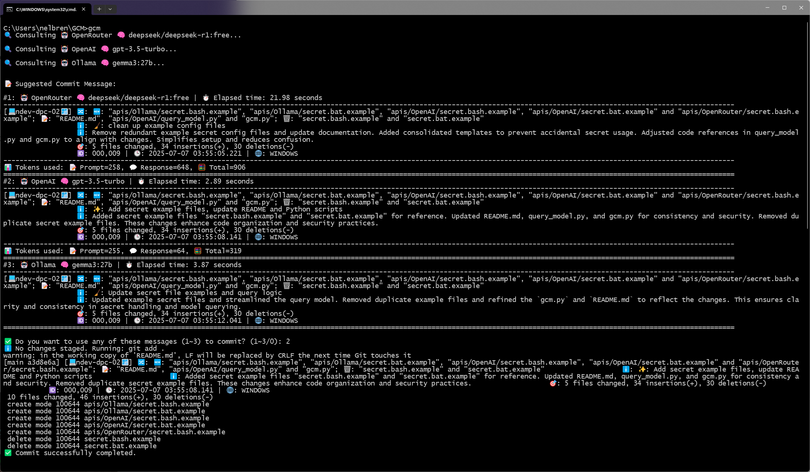

# GCM - Git Commit Message Generator

GCM (Git Commit Message Generator) is a cross-platform tool designed to help developers craft professional and consistent Git commit messages by leveraging AI (ChatGPT or Ollama) combined with real-time `git status` and `git diff` analysis.

---

## 🚀 Key Features

- **AI-Powered Commit Message Generation**\
  Uses either **ChatGPT** (via OpenAI API) or **Ollama** (local models) to generate concise and detailed commit messages based on actual changes detected in the repository.

- **Environment Detection with Emoji**\
  Automatically identifies the operating system or terminal environment (**Windows 🪟, MacOS 🍎, Linux 🐧, CYGWIN 🪟**) and includes an emoji in the commit header for visual reference.

- **File Change Classification**\
  Classifies changes into **Add 🆕, Change 📝, Delete 🗑️** categories with clear summaries.

- **Diff Summary Analysis**\
  Performs lightweight analysis of `git diff` output to summarize insertions, deletions, and modifications.

- **Prompt Templates via Config File**\
  Allows prompt customization through the `config.yml` file without modifying the source code. Multiple styles or languages can be supported.

- **Commit Numbering and Timestamp**\
  Appends a unique commit number (e.g., `000,057`) and precise timestamp (`YYYY-MM-DD HH:MM:SS.mss`) to each commit for easy tracking.

- **Token Usage and Execution Time**\
  Displays real-time statistics including token usage (Prompt 📝, Response 💬, Total 🧮) and the time spent on AI response generation ⏱️.

- **Dual Terminal and OS Compatibility**\
  Runs smoothly on **CMD**, **PowerShell**, **Cygwin Bash**, **Git Bash**, **Linux**, and **MacOS** terminals.

---

## 📦 Project Structure (Visual Placeholder)

```plaintext
GCM/
├── apis/
│   ├── OpenRouter/
│   │   ├── query_model.py
│   │   ├── secret.bash
│   │   └── secret.bat
│   ├── OpenAI/
│   │   ├── query_model.py
│   │   ├── secret.bash
│   │   └── secret.bat
│   └── Ollama/
│       ├── query_model.py
│       ├── secret.bash
│       └── secret.bat
├── gcm.py
├── gcm.bat
├── install.bat
├── install.bash
├── run.bat
├── run.bash
├── config.yml
├── requirements.txt
├── secret.bash
├── secret.bat
└── utils.py
```

📸 

---

## ⚙️ How It Works

1. **Prepare the Repository:** Ensure you have a valid `.git` directory.
2. **Run the Script:** Execute `run.bat` on Windows or `run.bash` on Unix-like systems.
3. **Review the Suggested Commit:** The AI proposes a message based on your staged or unstaged changes.
4. **Confirm and Commit:** You have the option to confirm or cancel before the actual commit is made.

- 📸 With Ollama:
  

---

## 🔑 Configuration (config.yml example)

```yaml
ollama_model: gemma3:27b
model_tier: cheap
max_tokens: 600
use_confirmation: true
save_history: true
history_path: ~/.gcm_history.log
max_characters: 500
suggested_messages: 3

emojis:
  header: "🔀"
  add: "🆕"
  change: "📝"
  delete: "🗑️"
  info: "ℹ️"
  summary: "🎯"
  windows: "🪟"
  macos: "🍎"
  linux: "🐧"

prompt_template: |
  You are an expert software engineer and Git practitioner. Based on the following Git status summary, generate a clear and complete Git commit message with the following structure:

  1. A concise summary line using the Conventional Commits format (e.g., feat:, fix:, chore:, refactor:).
  2. A short descriptive paragraph explaining what was added, changed, or removed and why.
  3. Optionally, include a brief explanation or rationale if it helps clarify the purpose of the changes.
  4. The total length of the commit message must not exceed 300 characters. If necessary, shorten the content but ensure that every sentence or idea is complete and not cut off mid-word or mid-phrase.
  5. Never leave a paragraph, sentence, or idea incomplete. Avoid unfinished sentences.
  6. Do not use markdown, use plain text.

  Changes:
  {changes}

  Diff summary:
  {diff}
```

---

## 🛠 Installation

- Use the provided `install.bat` (Windows) or `install.bash` (Linux/Mac) to set up the environment.
- Virtual environments are supported (`.venv`).
- Creates aliases or shortcuts for seamless execution.

- 📸 Part 1/2
  

- 📸 Part 2/2
  

---

## 🌐 Supported Models

- **OpenAI:** gpt-3.5-turbo, gpt-4o, or configurable models.
- **Ollama:** llama3, gemma, or any local model served by Ollama.
- **OpenRouter:** any free models.

---

## 🤖 Example Commit Message Output

📸 With OpenAI:


---

## 🔁 Round-robin and OpenRouter support

📸 With suggested_messages: 3


---

## 👨‍💻 Contributing

Feedback, suggestions, and improvements are welcome. Feel free to open an issue or submit a pull request.

---

## 🙏 Credits

Developed by 🧑‍💻 **Nelbren** with 🤖 AI assistance from **Aren 😎** (ChatGPT).\
Prompt engineering, code generation, emoji madness, and technical fine-tuning powered by **Aren**.

---

## 📄 License

MIT License *(or specify your preferred license here)*

