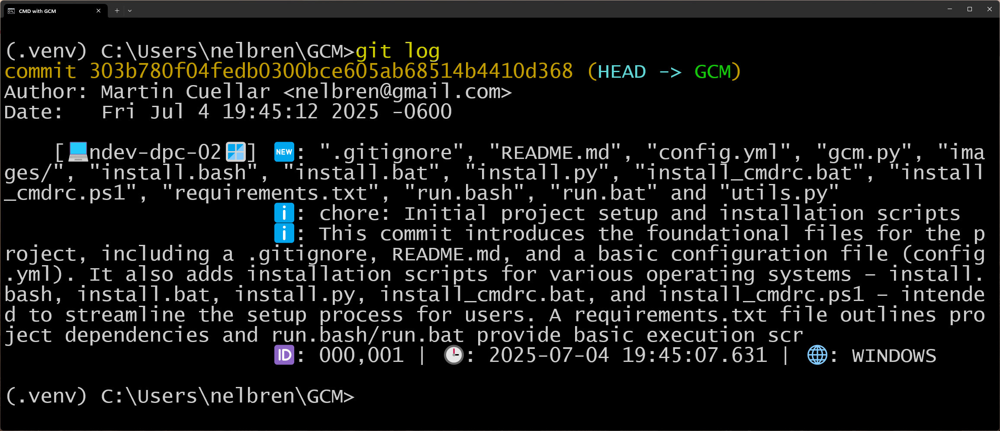
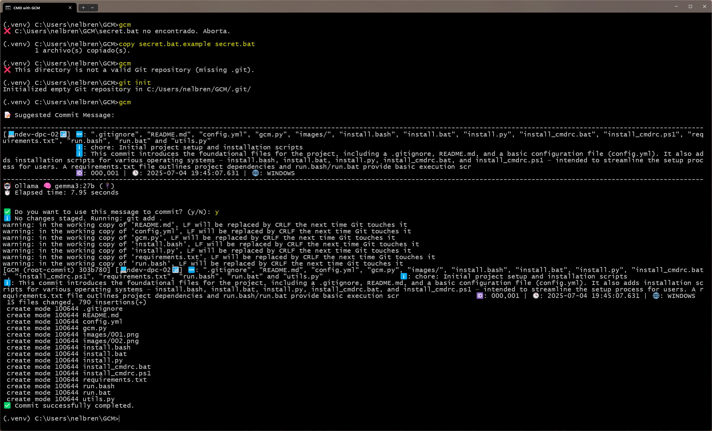
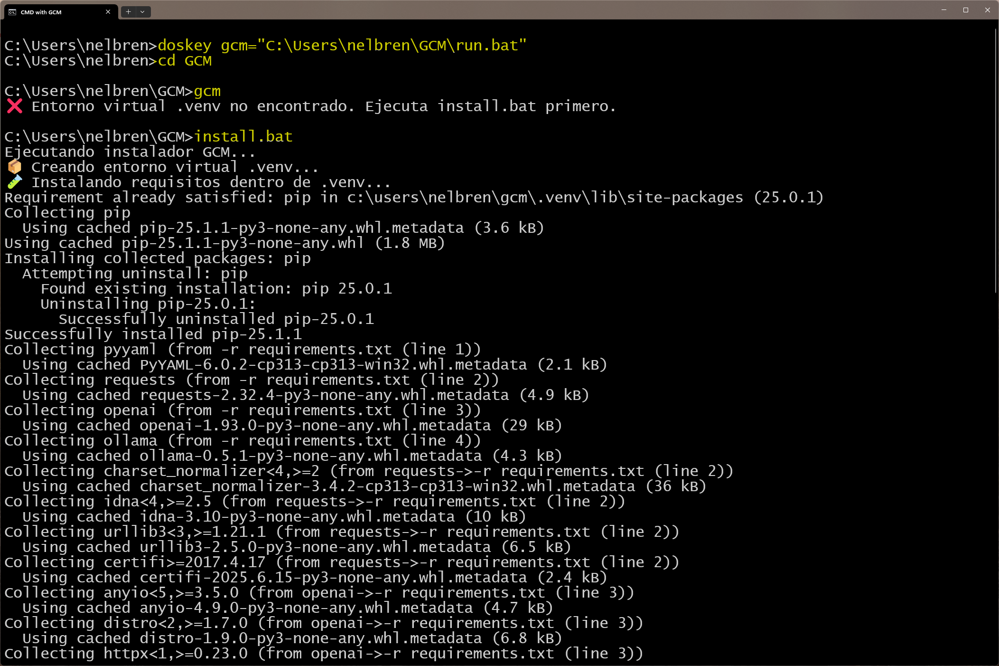
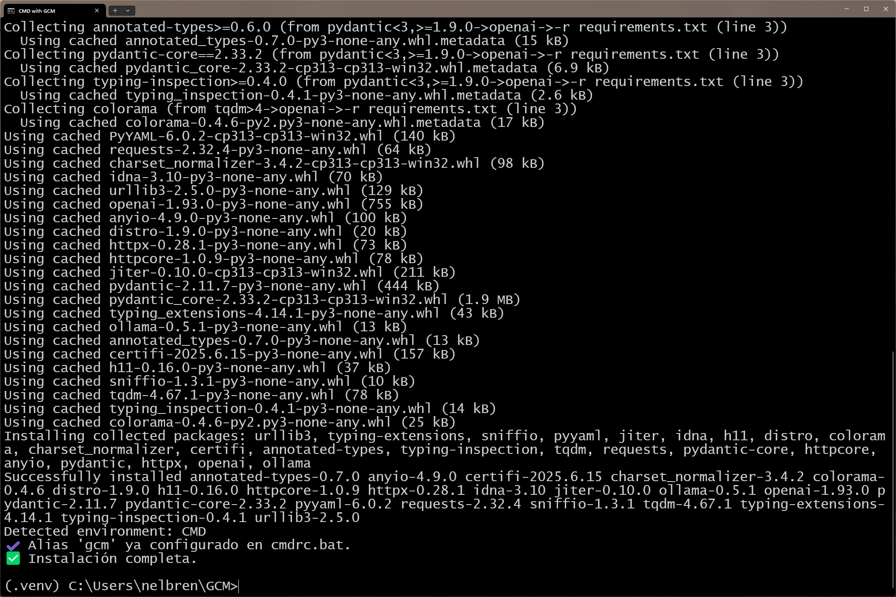
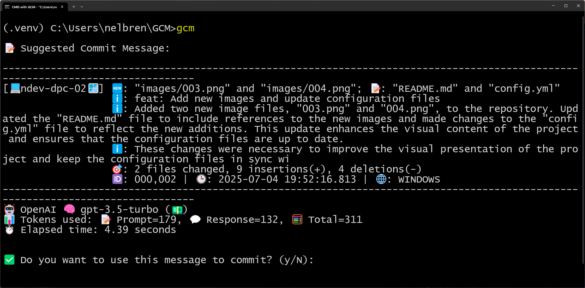
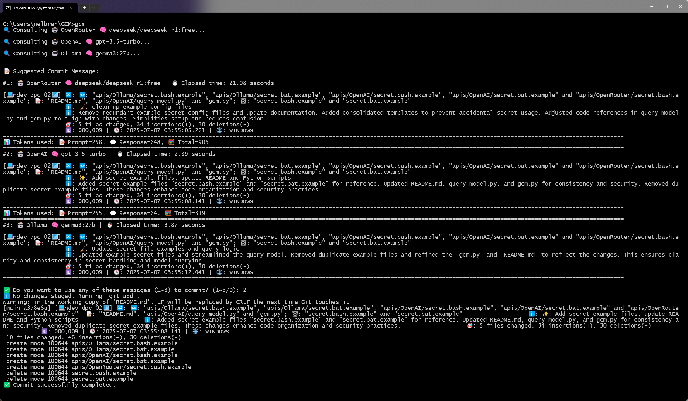

# GCM - Git Commit Message Generator

      

**GCM** (**G**it **C**ommit **M**essage Generator) is a cross-platform tool designed to help developers craft professional and consistent Git commit messages by leveraging AI (ChatGPT or Ollama) combined with real-time **`git status`** and **`git diff`** analysis.

---

## 🚀 Key Features

- **AI-Powered Commit Message Generation**\
  Uses either **ChatGPT** (via OpenAI API) or **Ollama** (local models) to generate concise and detailed commit messages based on actual changes detected in the repository.

- **Environment Detection with Emoji**\
  Automatically identifies the operating system or terminal environment (**Windows 🪟, MacOS 🍎, Linux 🐧, CYGWIN 🪟**) and includes an emoji in the commit header for visual reference.

- **File Change Classification**\
  Classifies changes into **Add 🆕, Change 📝, Delete 🗑️** categories with clear summaries.

- **Diff Summary Analysis**\
  Performs lightweight analysis of `git diff` output to summarize insertions, deletions, and modifications.

- **Prompt Templates via Config File**\
  Allows prompt customization through the `config.yml` file without modifying the source code. Multiple styles or languages can be supported.

- **Commit Numbering and Timestamp**\
  Appends a unique commit number (e.g., `000,057`) and precise timestamp (`YYYY-MM-DD HH:MM:SS.mss`) to each commit for easy tracking.

- **Token Usage and Execution Time**\
  Displays real-time statistics including token usage (Prompt 📝, Response 💬, Total 🧮) and the time spent on AI response generation ⏱️.

- **Multi-provider Orchestration**\
  Can combine generators, judges, and refiners across **Ollama**, **OpenRouter**, **OpenAI**, **Codex**, and **Claude**, depending on which credentials are available.

- **Structured History for Quality Analysis**\
  In addition to the human-readable history log, GCM can persist a JSON Lines audit trail with the selected provider, displayed candidates, judge/refiner roles, and final message.

- **Optional Location Metadata**\
  Location lookup is disabled by default and can be enabled with `include_location: true` if you want it in the commit footer.

- **Dual Terminal and OS Compatibility**\
  Runs smoothly on **CMD**, **PowerShell**, **Cygwin Bash**, **Git Bash**, **Linux**, and **MacOS** terminals.

---

## 📦 Project Structure (Visual Placeholder)

```plaintext
GCM/
├── apis/
│   ├── OpenRouter/
│   │   ├── query_model.py
│   │   ├── secret.bash
│   │   └── secret.bat
│   ├── OpenAI/
│   │   ├── query_model.py
│   │   ├── secret.bash
│   │   └── secret.bat
│   └── Ollama/
│       ├── query_model.py
│       ├── secret.bash
│       └── secret.bat
├── gcm.py
├── gcm.bat
├── install.bat
├── install.bash
├── run.bat
├── run.bash
├── config.yml
├── requirements.txt
├── version.cfg
├── version.py
├── version.txt
└── utils.py
```

📸 

---

## ⚙️ How It Works

1. **Prepare the Repository:** Ensure you have a valid `.git` directory.
2. **Run the Script:** Execute `run.bat` on Windows or `run.bash` on Unix-like systems.
3. **Review the Suggested Commit:** The AI proposes a message based on your staged or unstaged changes.
4. **Confirm and Commit:** You have the option to confirm or cancel before the actual commit is made.
5. **Optional Staging:** If nothing is staged yet, GCM asks before running `git add .`.

- 📸 With Ollama:
  

---

## 🔑 Configuration (config.yml example)

```yaml
max_tokens: 600
use_confirmation: true
save_history: true
history_path: ~/.gcm_history.log
history_json_path: ~/.gcm_history.jsonl
include_location: false
max_characters: 500
suggested_messages: 3
provider_strategy: auto
generator_count: 3
enable_judge: true
enable_refiner: false

providers:
  ollama:
    enabled: true
    priority: 30
    roles: ["generate"]
  openrouter:
    enabled: true
    priority: 40
    roles: ["generate"]
  openai:
    enabled: true
    priority: 70
    roles: ["generate", "judge", "refine"]
  claude:
    enabled: true
    priority: 95
    roles: ["generate", "judge", "refine"]
  codex:
    enabled: true
    priority: 100
    roles: ["generate", "judge", "refine"]

emojis:
  header: "🔀"
  add: "🆕"
  change: "📝"
  delete: "🗑️"
  info: "ℹ️"
  summary: "🎯"
  windows: "🪟"
  macos: "🍎"
  linux: "🐧"

prompt_template: |
  You are an expert software engineer and Git practitioner. Based on the following Git status summary, generate a clear and complete Git commit message with the following structure:

  1. A concise summary line using the Conventional Commits format (e.g., feat:, fix:, chore:, refactor:).
  2. A short descriptive paragraph explaining what was added, changed, or removed and why.
  3. Optionally, include a brief explanation or rationale if it helps clarify the purpose of the changes.
  4. The total length of the commit message must not exceed 300 characters. If necessary, shorten the content but ensure that every sentence or idea is complete and not cut off mid-word or mid-phrase.
  5. Never leave a paragraph, sentence, or idea incomplete. Avoid unfinished sentences.
  6. Do not use markdown, use plain text.

  Changes:
  {changes}

  Diff summary:
  {diff}
```

`history_json_path` stores one JSON object per committed message. This makes it easier to compare acceptance and quality across providers such as `Ollama`, `OpenRouter`, `OpenAI`, `Codex`, and `Claude`.

---

## 🛠 Installation

- Use the provided `install.bat` (🪟Windows) or `install.bash` (🐧Linux / 🍎MacOS) to set up the environment.
- Virtual environments are supported (`.venv`).
- Creates aliases or shortcuts for seamless execution.

- 📸 Part 1/2
  

- 📸 Part 2/2
  

---

## 🌐 Supported Models

- ### 🤖 Ollama: Supports models like 🧠 `llama3`, `gemma`, or any local model served by Ollama.

  - Local Ollama usage does not require an API key. Set `OLLAMA_MODEL` and ensure the Ollama host is reachable.

  - #### Environment Variable: `OLLAMA_MODEL`

    - ##### To list available models:
    
      - 🪟 **Windows (CMD):**
        
        - 💻 **Commands:**
          ```bash
          cd apis\Ollama
          list.bat
          ```

        - 👀 **Example:**
          ```
          C:\Users\nelbren\GCM\apis\Ollama>list.bat
          List models:
          ------------
          deepseek-coder:33b
          qwen2.5:72b
          gemma3:27b
          deepseek-r1:32b
          hhao/qwen2.5-coder-tools:32b
          hhao/qwen2.5-coder-tools:0.5b
          stable-code:3b-code-q4_0
          codegemma:2b
          gemma:2b
          ```

      - 🪟 **Windows (PowerShell):**

        - 💻 **Commands:**
          ```bash
          cd apis\Ollama
          .\run.bat
          ```

      - 🐧 **Linux** | 🍎 **macOS** | 🪟 **Windows (Cygwin / Git Bash):**

        - 💻 **Commands:**
          ```bash
          cd apis/Ollama
          ./list.bash
          ```


- ### OpenAI: `gpt-3.5-turbo`, `gpt-4o`, or configurable models.

  - #### Environment Variable: `MODEL_TIER`
    
      - ##### `cheap`
        - ###### OPENAI_MODEL=gpt-3.5-turbo
      - ##### `premium`
        - ###### OPENAI_MODEL=gpt-4o

    - ##### To list available models:
    
      - 🪟 **Windows (CMD):**

        - 💻 **Commands:**
          ```bash
          cd apis\OpenAI
          list.bat
          ```

        - 👀 **Example:**

        ```
        C:\Users\nelbren\GCM\apis\OpenAI>list.bat
        List models:
        ------------
        gpt-4-0613
        gpt-4
        gpt-3.5-turbo
        o4-mini-deep-research-2025-06-26
        codex-mini-latest
        gpt-4o-realtime-preview-2025-06-03
        gpt-4o-audio-preview-2025-06-03
        o4-mini-deep-research
        davinci-002
        babbage-002
        gpt-3.5-turbo-instruct
        gpt-3.5-turbo-instruct-0914
        dall-e-3
        dall-e-2
        gpt-4-1106-preview
        gpt-3.5-turbo-1106
        tts-1-hd
        tts-1-1106
        tts-1-hd-1106
        text-embedding-3-small
        text-embedding-3-large
        gpt-4-0125-preview
        gpt-4-turbo-preview
        gpt-3.5-turbo-0125
        gpt-4-turbo
        gpt-4-turbo-2024-04-09
        gpt-4o
        gpt-4o-2024-05-13
        gpt-4o-mini-2024-07-18
        gpt-4o-mini
        gpt-4o-2024-08-06
        chatgpt-4o-latest
        o1-preview-2024-09-12
        o1-preview
        o1-mini-2024-09-12
        o1-mini
        gpt-4o-realtime-preview-2024-10-01
        gpt-4o-audio-preview-2024-10-01
        gpt-4o-audio-preview
        gpt-4o-realtime-preview
        omni-moderation-latest
        omni-moderation-2024-09-26
        gpt-4o-realtime-preview-2024-12-17
        gpt-4o-audio-preview-2024-12-17
        gpt-4o-mini-realtime-preview-2024-12-17
        gpt-4o-mini-audio-preview-2024-12-17
        o1-2024-12-17
        o1
        gpt-4o-mini-realtime-preview
        gpt-4o-mini-audio-preview
        o3-mini
        o3-mini-2025-01-31
        gpt-4o-2024-11-20
        gpt-4.5-preview
        gpt-4.5-preview-2025-02-27
        gpt-4o-search-preview-2025-03-11
        gpt-4o-search-preview
        gpt-4o-mini-search-preview-2025-03-11
        gpt-4o-mini-search-preview
        gpt-4o-transcribe
        gpt-4o-mini-transcribe
        o1-pro-2025-03-19
        o1-pro
        gpt-4o-mini-tts
        o4-mini-2025-04-16
        o4-mini
        gpt-4.1-2025-04-14
        gpt-4.1
        gpt-4.1-mini-2025-04-14
        gpt-4.1-mini
        gpt-4.1-nano-2025-04-14
        gpt-4.1-nano
        gpt-image-1
        gpt-3.5-turbo-16k
        tts-1
        whisper-1
        text-embedding-ada-002
        ```

      - 🪟 **Windows (PowerShell):**

        - 💻 **Commands:**
          ```bash
          cd apis\OpenAI
          .\run.bat
          ```

      - 🐧 **Linux** | 🍎 **macOS** | 🪟 **Windows (Cygwin / Git Bash):**

        - 💻 **Commands:**
          ```bash
          cd apis/OpenAI
          ./list.bash
          ```

  - #### Environment Variable: `OPENAI_MODEL`

    - ###### Select specific model from **OpenAI**

- ### OpenRouter: any free models.

  - #### Environment Variable: `OPENROUTER_MODEL`

    - ##### `FreeAll`
      Selects any available free model, without prioritization. Broadest selection.

    - ##### `FreeTop`  
      Selects the top-rated free models based on community feedback and performance.

    - ##### `FreeCtxMax`  
      Prioritizes free models with the largest context window available for longer prompts.

    - ##### `FreeSmart`  
      Dynamically selects the most balanced free model considering speed, context, and quality.


    - ##### To list available models:
    
      - 🪟 **Windows (CMD):**

        - 💻 **Commands:**
          ```bash
          cd apis\OpenRoute
          list.bat
          ```

        - 👀 **Example:**

        ```
        C:\Users\nelbren\GCM\apis\OpenRouter>list.bat
        Free models:
        ------------
        tencent/hunyuan-a13b-instruct:free
        tngtech/deepseek-r1t2-chimera:free
        openrouter/cypher-alpha:free
        mistralai/mistral-small-3.2-24b-instruct:free
        moonshotai/kimi-dev-72b:free
        deepseek/deepseek-r1-0528-qwen3-8b:free
        deepseek/deepseek-r1-0528:free
        sarvamai/sarvam-m:free
        mistralai/devstral-small:free
        google/gemma-3n-e4b-it:free
        qwen/qwen3-30b-a3b:free
        qwen/qwen3-8b:free
        qwen/qwen3-14b:free
        qwen/qwen3-32b:free
        qwen/qwen3-235b-a22b:free
        tngtech/deepseek-r1t-chimera:free
        microsoft/mai-ds-r1:free
        thudm/glm-z1-32b:free
        thudm/glm-4-32b:free
        shisa-ai/shisa-v2-llama3.3-70b:free
        arliai/qwq-32b-arliai-rpr-v1:free
        agentica-org/deepcoder-14b-preview:free
        moonshotai/kimi-vl-a3b-thinking:free
        nvidia/llama-3.3-nemotron-super-49b-v1:free
        meta-llama/llama-4-maverick:free
        meta-llama/llama-4-scout:free
        deepseek/deepseek-v3-base:free
        google/gemini-2.5-pro-exp-03-25
        qwen/qwen2.5-vl-32b-instruct:free
        deepseek/deepseek-chat-v3-0324:free
        featherless/qwerky-72b:free
        mistralai/mistral-small-3.1-24b-instruct:free
        google/gemma-3-4b-it:free
        google/gemma-3-12b-it:free
        rekaai/reka-flash-3:free
        google/gemma-3-27b-it:free
        qwen/qwq-32b:free
        nousresearch/deephermes-3-llama-3-8b-preview:free
        cognitivecomputations/dolphin3.0-r1-mistral-24b:free
        cognitivecomputations/dolphin3.0-mistral-24b:free
        qwen/qwen2.5-vl-72b-instruct:free
        mistralai/mistral-small-24b-instruct-2501:free
        deepseek/deepseek-r1-distill-qwen-14b:free
        deepseek/deepseek-r1-distill-llama-70b:free
        deepseek/deepseek-r1:free
        deepseek/deepseek-chat:free
        google/gemini-2.0-flash-exp:free
        meta-llama/llama-3.3-70b-instruct:free
        qwen/qwen-2.5-coder-32b-instruct:free
        meta-llama/llama-3.2-11b-vision-instruct:free
        qwen/qwen-2.5-72b-instruct:free
        mistralai/mistral-nemo:free
        google/gemma-2-9b-it:free
        mistralai/mistral-7b-instruct:free
        ```

      - 🪟 **Windows (PowerShell):**

        - 💻 **Commands:**
          ```bash
          cd apis\OpenRoute
          .\run.bat
          ```

      - 🐧 **Linux** | 🍎 **macOS** | 🪟 **Windows (Cygwin / Git Bash):**

        - 💻 **Commands:**
          ```bash
          cd apis/OpenRoute
          ./list.bash
          ```


---

## 🤖 Example Commit Message Output

📸 With OpenAI:


---

## 🔁 Round-robin and OpenRouter support

📸 With suggested_messages: 3


---

## 📊 History Analytics

If `save_history: true` and `history_json_path` is enabled, you can inspect provider acceptance and average response times with:

```bash
python report_history.py
```

The report is designed for terminal usage and uses **Rich** tables with color when the dependency is installed. Recommended reading order:

- `Accept/Shown`: relative acceptance of a provider against the times it was actually shown as a candidate.
- `Accept/Commits`: overall share of final selected messages across all analyzed commits.
- `Avg Selected`: average elapsed time when that provider ended up selected.
- `Avg Shown`: average elapsed time across all displayed messages from that provider.
- `Gen`, `Judge`, `Refine`: how often the provider was used in each orchestration role.

This gives you a concrete way to compare whether `Codex`, `Claude`, `OpenAI`, `Ollama`, or `OpenRouter` are producing the best tradeoff between quality and latency.

---

## 👨‍💻 Contributing

Feedback, suggestions, and improvements are welcome. Feel free to open an issue or submit a pull request.

---

## 🙏 Credits

Developed by 🧑‍💻 **Nelbren** with 🤖 AI assistance from **Aren 😎** (ChatGPT).\
Prompt engineering, code generation, emoji madness, and technical fine-tuning powered by **Aren**.

---

## 📄 License

MIT License *(or specify your preferred license here)*

